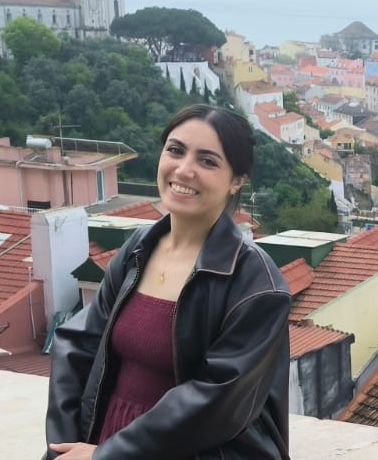

<h1>About me</h1>

  

    
  

  

    <h3>Néda El Hadj-Mimoune</h3>
    
I am a technical writer with more than 4 years of experience structuring and simplifying complex information to ensure optimal user experience. 

    
I am currently looking for opportunities in tech companies that use the docs-as-code approach. I am based in Paris but open to relocate. Looking for hybrid or remote roles.

  

## Explore my work

- [:material-wallet-travel: Experience](experience.md)
- [:simple-libreofficewriter: Writing Samples](writing-samples.md)
- [:material-tools: Skills](skills.md)
- [:material-certificate: Education and certifications](education.md)

## Contact me

- [:material-linkedin: LinkedIn](https://www.linkedin.com/in/n%C3%A9da-mimoune/)
- [:material-email-multiple: Email](mailto:neda.ryanne2@gmail.com)
- [:material-github: GitHub](https://github.com/nerda-codes)
- [:material-download: Download my CV as PDF](assets/my-cv.pdf)

